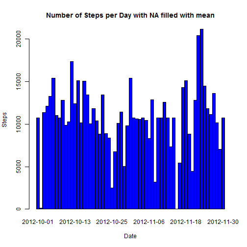

## Loading and preprocessing the data

### 1 - Load the data (i.e. read.csv())

```r
library(lubridate)

if (!file.exists('activity.csv'))
    unzip('activity.zip')
originalData <- read.csv("activity.csv")

# check data
head(originalData)
```

```
##   steps       date interval
## 1    NA 2012-10-01        0
## 2    NA 2012-10-01        5
## 3    NA 2012-10-01       10
## 4    NA 2012-10-01       15
## 5    NA 2012-10-01       20
## 6    NA 2012-10-01       25
```

```r
str(originalData)
```

```
## 'data.frame':	17568 obs. of  3 variables:
##  $ steps   : int  NA NA NA NA NA NA NA NA NA NA ...
##  $ date    : Factor w/ 61 levels "2012-10-01","2012-10-02",..: 1 1 1 1 1 1 1 1 1 1 ...
##  $ interval: int  0 5 10 15 20 25 30 35 40 45 ...
```

### 2 - Process/transform the data (if necessary) into a format suitable for your analysis 

```r
# formate the date (from Factor to Date)
originalData$date <- as.Date(originalData$date, format="%Y-%m-%d")

# check formated data
head(originalData)
```

```
##   steps       date interval
## 1    NA 2012-10-01        0
## 2    NA 2012-10-01        5
## 3    NA 2012-10-01       10
## 4    NA 2012-10-01       15
## 5    NA 2012-10-01       20
## 6    NA 2012-10-01       25
```

```r
str(originalData)
```

```
## 'data.frame':	17568 obs. of  3 variables:
##  $ steps   : int  NA NA NA NA NA NA NA NA NA NA ...
##  $ date    : Date, format: "2012-10-01" "2012-10-01" ...
##  $ interval: int  0 5 10 15 20 25 30 35 40 45 ...
```

 
 
## What is mean total number of steps taken per day?
 
### 1 - Calculate the total number of steps taken per day

```r
# summarize steps per day
dailySteps <- aggregate(steps ~ date, data = originalData, sum, na.rm=TRUE)
head(dailySteps)
```

```
##         date steps
## 1 2012-10-02   126
## 2 2012-10-03 11352
## 3 2012-10-04 12116
## 4 2012-10-05 13294
## 5 2012-10-06 15420
## 6 2012-10-07 11015
```
 
### 2 - Make a histogram of the total number of steps taken each day

```r
# make a histogram
barplot(dailySteps$steps, names.arg = dailySteps$date, main="Number of Steps per Day", 
        xlab="Date", ylab="Steps", col = "blue", space=c(0)) 
```

 

### 3 - Calculate and report the mean and median of the total number of steps taken per day
Mean of the total number of steps taken per day

```r
# calculate mean of the total steps taken per day
mean(dailySteps$steps, na.rm = TRUE)
```

```
## [1] 10766.19
```
Median of the total number of steps taken per day

```r
# calculate median of the total steps taken per day
median(dailySteps$steps, na.rm = TRUE) 
```

```
## [1] 10765
```

 
## What is the average daily activity pattern?

### 1 - Make a time series plot (i.e. type = "l") of the 5-minute interval (x-axis) and the average number of steps taken, averaged across all days (y-axis)

```r
# summarize steps per interval
stepsInterval <- aggregate(steps ~ interval, data = originalData, FUN = mean)
# make a plot of steps by interval
plot(stepsInterval, type = "l", col = "blue", main="Number of Steps per Interval")
```

 

### 2- Show Which 5-minute interval, on average across all the days in the dataset, contains the maximum number of steps?

```r
#find an interval with max steps
maxSteps <- stepsInterval$interval[which.max(stepsInterval$steps)]
```
On average across all the days in the dataset, the 5-minute interval that contains the maximum number of steps is 835.


 
## Imputing missing values

### 1 - Calculate and report the total number of missing values in the dataset (i.e. the total number of rows with NAs)

```r
# use complete.cases to remove NA
naCases <- sum(!complete.cases(originalData))
```
Total number of missing values in the dataset is 2304

### 2 - Devise a strategy for filling in all of the missing values in the dataset. 
Use mean to fill in missing values for steps.

```r
# copy original data to a new dataset
completeData <- originalData
# Use the 5 minute interval mean to fill in missing values
completeData$steps[is.na(completeData$steps)] <- tapply(completeData$steps, completeData$interval, mean, na.rm = TRUE)
```

### 3 - Create a new dataset that is equal to the original dataset but with the missing data filled in.


```r
# compare old and new data sets to show NA are gone
summary(originalData)
```

```
##      steps             date               interval     
##  Min.   :  0.00   Min.   :2012-10-01   Min.   :   0.0  
##  1st Qu.:  0.00   1st Qu.:2012-10-16   1st Qu.: 588.8  
##  Median :  0.00   Median :2012-10-31   Median :1177.5  
##  Mean   : 37.38   Mean   :2012-10-31   Mean   :1177.5  
##  3rd Qu.: 12.00   3rd Qu.:2012-11-15   3rd Qu.:1766.2  
##  Max.   :806.00   Max.   :2012-11-30   Max.   :2355.0  
##  NA's   :2304
```

```r
summary(completeData)
```

```
##      steps             date               interval     
##  Min.   :  0.00   Min.   :2012-10-01   Min.   :   0.0  
##  1st Qu.:  0.00   1st Qu.:2012-10-16   1st Qu.: 588.8  
##  Median :  0.00   Median :2012-10-31   Median :1177.5  
##  Mean   : 37.38   Mean   :2012-10-31   Mean   :1177.5  
##  3rd Qu.: 27.00   3rd Qu.:2012-11-15   3rd Qu.:1766.2  
##  Max.   :806.00   Max.   :2012-11-30   Max.   :2355.0
```
New and old datasets are equal but new has no NA steps.


### 4 - Make a histogram of the total number of steps taken each day and calculate and report the mean and median total number of steps taken per day. Do these values differ from the estimates from the first part of the assignment? 


```r
# summarize steps per day for new dataset
fullSteps <- aggregate(steps ~ date, data = completeData, sum)
# make a histogram
barplot(fullSteps$steps, names.arg = fullSteps$date, main="Number of Steps per Day with NA filled with mean", 
        xlab="Date", ylab="Steps", col = "blue", space=c(0)) 
```

 

The impact of the missing data filled with mean seems low when estimating the total number of steps per day.


### 5 - What is the impact of imputing missing data on the estimates of the total daily number of steps?

```r
# calculate mean of the total steps taken per day without NA
mean(fullSteps$steps) 
```

```
## [1] 10766.19
```

```r
# value of mean with NA
mean(dailySteps$steps) 
```

```
## [1] 10766.19
```

```r
# calculate median of the total steps taken per day without  NA
median(fullSteps$steps)
```

```
## [1] 10766.19
```

```r
# value of median with NA
median(dailySteps$steps)
```

```
## [1] 10765
```
Mean didn't change but Median is now the same as Mean .


 
## Are there differences in activity patterns between weekdays and weekends?

### 1 - Create a new factor variable in the dataset with two levels - "weekday" and "weekend" indicating whether a given date is a weekday or weekend day.


```r
# create weekday column for weekday or weekend values
completeData$daytype <- ifelse(weekdays(completeData$date) %in% c("Saturday", "Sunday"), 'weekend', 'weekday')
head(completeData)
```

```
##       steps       date interval daytype
## 1 1.7169811 2012-10-01        0 weekday
## 2 0.3396226 2012-10-01        5 weekday
## 3 0.1320755 2012-10-01       10 weekday
## 4 0.1509434 2012-10-01       15 weekday
## 5 0.0754717 2012-10-01       20 weekday
## 6 2.0943396 2012-10-01       25 weekday
```

### 2 - Make a panel plot containing a time series plot (i.e. type = "l") of the 5-minute interval (x-axis) and the average number of steps taken, averaged across all weekday days or weekend days (y-axis).


```r
# get mean by interval and daytype
stepsIntervalDaytype <- aggregate(steps ~ interval + daytype, completeData, FUN = "mean")
head(stepsIntervalDaytype)
```

```
##   interval daytype      steps
## 1        0 weekday 2.25115304
## 2        5 weekday 0.44528302
## 3       10 weekday 0.17316562
## 4       15 weekday 0.19790356
## 5       20 weekday 0.09895178
## 6       25 weekday 1.59035639
```

```r
library(lattice)
xyplot(steps ~ interval | daytype, stepsIntervalDaytype, layout = c(1, 2), 
       xlab="interval", ylab="average steps", type = "l", col="blue",
       main = "Average steps pattern by weekend/weekdays")
```

 


